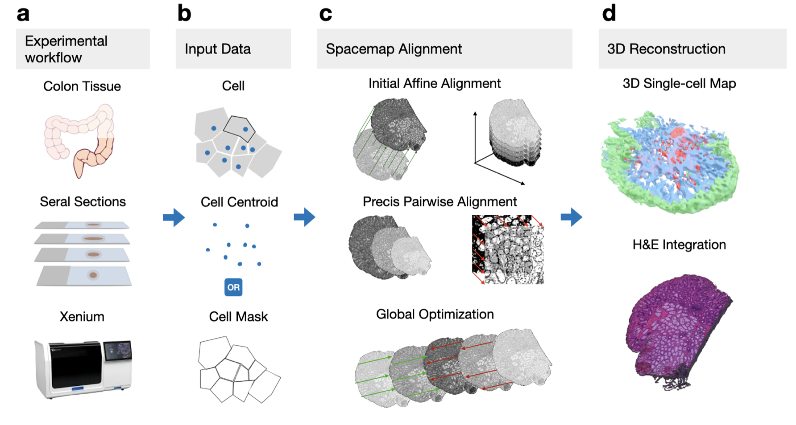

# Quick Start Guide

This guide will help you get started with Space-map by walking through a basic 3D tissue reconstruction workflow.



## Prerequisites

Before starting, make sure you have:

1. **Installed Space-map** - See [Installation Guide](installation.md)
2. **Prepared your spatial data** - Cell coordinates with layer/section identifiers

Your data should be in a format like:

| x | y | layer |
|---|---|-------|
| 100.5 | 200.3 | 0 |
| 150.2 | 180.7 | 0 |
| ... | ... | ... |

## Complete Workflow Example

### Step 1: Import Libraries

```python
import spacemap
from spacemap import Slice
import pandas as pd
import numpy as np
import matplotlib.pyplot as plt

print(f"Space-map version: {spacemap.__version__}")
```

### Step 2: Load and Organize Data

```python
# Load cell coordinate data from CSV file
df = pd.read_csv("path/to/cells.csv.gz")

# Organize data by layers
xys = []  # List of coordinate arrays (N×2) for each layer
layer_ids = []  # Layer identifiers

for layer_id in sorted(df['layer'].unique()):
    layer_data = df[df['layer'] == layer_id]
    xy = layer_data[['x', 'y']].values
    xys.append(xy)
    layer_ids.append(layer_id)

print(f"Loaded {len(xys)} layers")
```

### Step 3: Initialize Project

```python
# Set project base directory
BASE = "data/flow"

# Initialize Flow processing system
flowImport = spacemap.flow.FlowImport(BASE)

# Initialize slices with coordinate data
flowImport.init_xys(xys, ids=layer_ids)

# Get slice objects for processing
slices = flowImport.slices

print(f"Initialized {len(slices)} slices")
print(f"Canvas size (XYRANGE): {spacemap.XYRANGE}")
print(f"Grid spacing (XYD): {spacemap.XYD}")
```

### Step 4: Perform Affine Registration (Coarse Alignment)

Space-map uses a two-stage registration approach. First, perform affine registration for global alignment:

```python
# Create registration manager
# AutoFlowMultiCenter4 is recommended for most cases
mgr = spacemap.flow.AutoFlowMultiCenter4(slices, Slice.rawKey)

# Set alignment method
# Options: "auto" (recommended), "sift", "sift_vgg", "loftr"
mgr.alignMethod = "auto"

# Perform affine registration
# "DF" = Density Field representation
# show=True displays intermediate visualizations (set False for speed)
mgr.affine("DF", show=True)

print("Affine registration completed!")
```

### Step 5: Perform LDDMM (Fine Alignment)

After coarse alignment, perform fine registration using LDDMM for precise local deformations:

```python
# Perform LDDMM registration between adjacent sections
# This preserves local micro-anatomical structures
mgr.ldm_pair(Slice.align1Key, Slice.align2Key, show=True)

print("LDDMM registration completed!")
```

### Step 6: Visualize Results

```python
# Create 3D visualization of aligned tissue sections
fig = plt.figure(figsize=(12, 10))
ax = fig.add_subplot(111, projection='3d')

# Color each layer differently
colors = plt.cm.viridis(np.linspace(0, 1, len(slices)))
z_spacing = 10  # Units between layers

for i, slice_obj in enumerate(slices):
    # Get aligned coordinates
    points = slice_obj.imgs[Slice.rawKey].get_points(Slice.align2Key)

    # Add z-coordinate
    z = np.ones(len(points)) * i * z_spacing

    # Plot
    ax.scatter(points[:, 0], points[:, 1], z,
               color=colors[i], s=1, alpha=0.6,
               label=f"Layer {slice_obj.id}")

ax.set_xlabel('X')
ax.set_ylabel('Y')
ax.set_zlabel('Z (Layer)')
ax.legend()
plt.title('3D Tissue Reconstruction')
plt.show()
```

### Step 7: Export Results

```python
# Create export manager
export = spacemap.flow.FlowExport(slices)

# Export aligned coordinates
aligned_data = []

for i, slice_obj in enumerate(slices):
    points = slice_obj.imgs[Slice.rawKey].get_points(Slice.align2Key)
    z = i * z_spacing

    for point in points:
        aligned_data.append({
            'x': point[0],
            'y': point[1],
            'z': z,
            'layer': slice_obj.id
        })

# Save to CSV
df_aligned = pd.DataFrame(aligned_data)
df_aligned.to_csv(f'{BASE}/aligned_cells.csv.gz',
                  index=False, compression='gzip')

print(f"Exported {len(df_aligned)} aligned cells")
```

## Working with Different Data Types

### CODEX Data

For CODEX spatial proteomics data with 'array' column:

```python
flowImport = spacemap.flow.FlowImport(BASE)
flowImport.init_from_codex('codex_data.csv')
slices = flowImport.slices
```

### Multiple Manager Options

Space-map provides different manager classes:

```python
# Option 1: AutoFlowMultiCenter4 (Recommended)
# Processes from center outward for better global consistency
mgr = spacemap.flow.AutoFlowMultiCenter4(slices, Slice.rawKey)

# Option 2: AutoFlowMultiCenter5
# Latest version with additional optimizations
mgr = spacemap.flow.AutoFlowMultiCenter5(slices, Slice.rawKey)

# Option 3: AutoFlowMultiCenter3
# Simpler sequential processing
mgr = spacemap.flow.AutoFlowMultiCenter3(slices)
```

## Tips for Success

1. **Start Small**: Test with a subset of layers first
2. **Check Intermediate Results**: Use `show=True` to visualize alignment
3. **Try Different Methods**: If `"auto"` doesn't work well, try `"sift_vgg"` or `"loftr"`
4. **GPU Acceleration**: Space-map automatically uses GPU if available
5. **Memory Management**: For large datasets, reduce `spacemap.XYD` if needed

## Next Steps

- **[Interactive Tutorial](../../examples/01_quickstart.ipynb)** - Complete notebook with visualizations
- **[Advanced Examples](../../examples/02_advanced_registration.ipynb)** - Parameter tuning and quality assessment
- **[Examples Gallery](../examples/examples.md)** - More use cases and techniques
- **[API Reference](../api/api.md)** - Comprehensive documentation

## Common Issues

**Q: Registration is slow**
A: Set `show=False` in affine and ldm_pair methods. GPU acceleration is automatic if available.

**Q: Alignment looks poor**
A: Try different `alignMethod` options: `"auto"`, `"sift_vgg"`, or `"loftr"`.

**Q: Out of memory errors**
A: Reduce resolution by setting `spacemap.XYD` to a larger value (e.g., 20 instead of 10).

For more help, [open an issue](https://github.com/czhu/space-map/issues) on GitHub. 